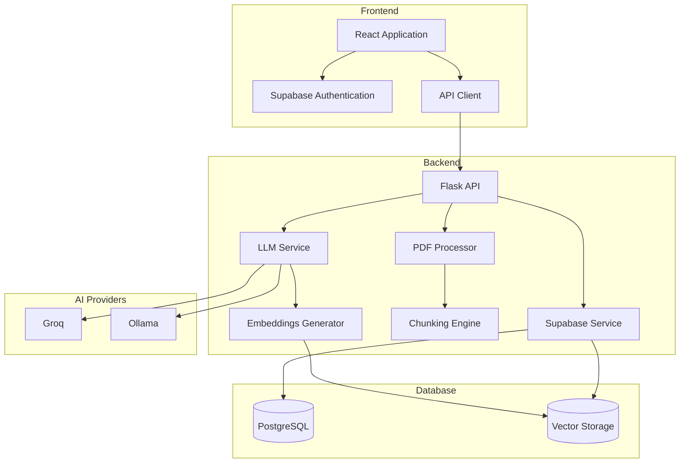
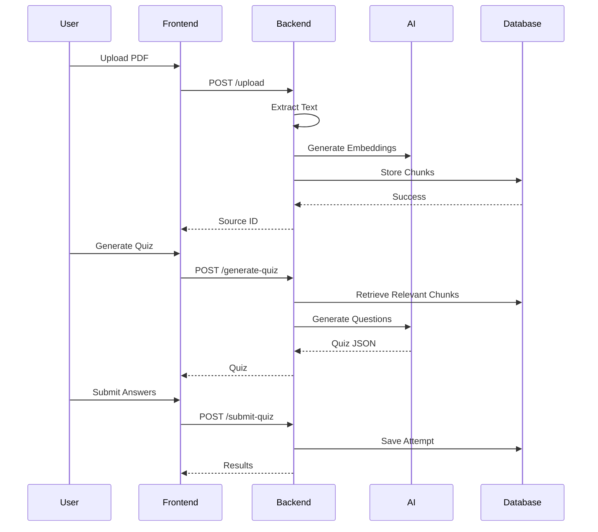

# 📚 PDF Quiz Generator

### Transform Any PDF into an Intelligent Assessment System

<div align="center">


**Generate AI-powered quizzes from PDFs in seconds.**

*No API costs required • Local-first architecture • Bloom's Taxonomy-based assessments*

</div>

---

## 🚀 Overview

PDF Quiz Generator is an AI-powered learning platform that automatically converts PDF documents into high-quality multiple-choice quizzes. The system extracts content, generates semantic embeddings, retrieves relevant context, and creates assessment questions across multiple cognitive difficulty levels.

Whether you're a student, educator, trainer, or researcher, PDF Quiz Generator helps transform static content into interactive learning experiences.

### Key Benefits

* 🤖 AI-generated quiz questions from any PDF
* 🎓 Bloom's Taxonomy-based difficulty progression
* ⚡ Parallel question generation for fast results
* 🔍 Semantic vector search for contextual accuracy
* 🔐 Secure user authentication and data isolation
* 🏠 Fully local deployment option with Ollama
* 💰 Free cloud option using Groq

---

## ✨ Features

| Feature                       | Description                                               |
| ----------------------------- | --------------------------------------------------------- |
| 🤖 AI Question Generation     | Generate intelligent multiple-choice questions using LLMs |
| 🎓 Multiple Difficulty Levels | Basic, Standard, Advanced, and Deep Dive                  |
| ⚡ Parallel Processing         | Generate quizzes up to 5x faster using concurrent workers |
| 🎯 Topic-Focused Generation   | Target specific concepts within a PDF                     |
| 🔍 Vector Search Retrieval    | Retrieve relevant chunks using semantic similarity        |
| 🔐 User Authentication        | Secure login and user-specific data access                |
| 🏠 Local AI Support           | Run entirely offline with Ollama                          |
| ☁️ Cloud AI Support           | Use Groq's fast inference API                             |
| 📊 Performance Tracking       | Save quiz attempts and results                            |
| 🗄️ Scalable Storage          | Powered by Supabase and PostgreSQL                        |

---

## 🏗️ System Architecture



---

## 🎓 Bloom's Taxonomy-Based Difficulty Levels

The platform generates questions according to cognitive complexity:

| Level        | Objective                           | Example                                                                               |
| ------------ | ----------------------------------- | ------------------------------------------------------------------------------------- |
| 🟢 Basic     | Remember facts and concepts         | "Who became the first Roman Emperor?"                                                 |
| 🔵 Standard  | Understand relationships and causes | "Why did the Punic Wars strengthen Rome?"                                             |
| 🟣 Advanced  | Analyze and evaluate information    | "Which factor most influenced Rome's transition to Empire?"                           |
| 🟠 Deep Dive | Synthesize concepts and systems     | "How did geography, governance, and military strategy contribute to Roman expansion?" |

---

## 📊 Performance

### Question Generation Speed

| Mode                  | 10 Questions | 20 Questions | 30 Questions |
| --------------------- | ------------ | ------------ | ------------ |
| Sequential Processing | 60s          | 120s         | 180s         |
| Groq (Parallel)       | **8s**       | **15s**      | **22s**      |
| Ollama 7B (Parallel)  | 12s          | 22s          | 32s          |

### Why It's Fast

* Parallel LLM requests
* Semantic chunk retrieval
* Optimized prompt engineering
* Configurable worker pools
* Efficient vector search

---

# 🚀 Quick Start

## Prerequisites

### Required

* Python 3.9+
* Node.js 18+
* Supabase Account
* Groq API Key **or** Ollama

### Optional

* Ollama for fully local deployments

---

## 1. Clone the Repository

```bash
git clone https://github.com/yourusername/pdf-quiz-generator.git

cd pdf-quiz-generator
```

---

## 2. Backend Setup

```bash
cd backend

python -m venv venv

source venv/bin/activate
# Windows:
# venv\Scripts\activate

pip install -r requirements.txt
```

---

## 3. Frontend Setup

```bash
cd ../frontend

npm install
```

---

## 4. Configure Environment Variables

### Backend

```bash
cp .env.example .env
```

Example configuration:

```env
# AI Provider
USE_GROQ=true
USE_OLLAMA=false

GROQ_API_KEY=gsk_xxxxxxxxxxxxxxxxx

# Supabase
SUPABASE_URL=https://your-project.supabase.co
SUPABASE_KEY=your-anon-key

# Embeddings
CLOUDFLARE_ACCOUNT_ID=your-account-id
CLOUDFLARE_API_TOKEN=your-token
```

### Frontend

```env
VITE_SUPABASE_URL=https://your-project.supabase.co
VITE_SUPABASE_ANON_KEY=your-anon-key
VITE_API_URL=http://localhost:5000/api
```

---

## 5. Database Setup

Enable pgvector:

```sql
CREATE EXTENSION IF NOT EXISTS vector;
```

Create required tables:

```sql
CREATE TABLE sources (...);

CREATE TABLE pdf_chunks (...);

CREATE TABLE quizzes (...);

CREATE TABLE quiz_attempts (...);
```

Enable Row Level Security:

```sql
ALTER TABLE sources ENABLE ROW LEVEL SECURITY;
ALTER TABLE pdf_chunks ENABLE ROW LEVEL SECURITY;
ALTER TABLE quizzes ENABLE ROW LEVEL SECURITY;
ALTER TABLE quiz_attempts ENABLE ROW LEVEL SECURITY;
```

Example policy:

```sql
CREATE POLICY "Users can view their own sources"
ON sources
FOR SELECT
USING (auth.uid() = user_id);
```

---

## ▶️ Run the Application

### Start Backend

```bash
cd backend

python app.py
```

### Start Frontend

```bash
cd frontend

npm run dev
```

Open:

```text
http://localhost:5173
```

---

# 🤖 AI Provider Options

## Option 1 — Groq (Recommended)

Fastest option for most users.

### Advantages

* Extremely low latency
* Free tier available
* No local hardware required

```env
USE_GROQ=true
GROQ_API_KEY=gsk_xxxxx
```

---

## Option 2 — Ollama (Fully Local)

Run everything on your machine.

### Install Ollama

```bash
curl -fsSL https://ollama.ai/install.sh | sh
```

### Download a Model

```bash
ollama pull mistral:7b
```

Other supported models:

```bash
ollama pull llama3.2:3b
ollama pull llama3.1:8b
```

### Configure

```env
USE_OLLAMA=true

OLLAMA_URL=http://localhost:11434
OLLAMA_MODEL=mistral:7b
```

---

## 📂 Project Structure

```text
pdf-quiz-generator
│
├── backend
│   ├── app.py
│   ├── config.py
│   ├── llm_service.py
│   ├── groq_service.py
│   ├── ollama_service.py
│   ├── pdf_processor.py
│   ├── supabase_service.py
│   └── requirements.txt
│
├── frontend
│   ├── src
│   │   ├── components
│   │   ├── services
│   │   ├── styles
│   │   ├── App.jsx
│   │   └── main.jsx
│   │
│   ├── package.json
│   └── vite.config.js
│
└── docker-compose.yml
```

---

# 📋 API Workflow



---

# 🧪 Testing

## Manual Test Procedure

1. Register/Login
2. Upload a PDF
3. Wait for indexing
4. Choose difficulty level
5. Generate quiz
6. Answer questions
7. Submit quiz
8. Review results

---

## Health Check

```bash
curl http://localhost:5000/api/health
```

---

## Verify Ollama

```bash
curl http://localhost:11434/api/tags
```

---

# 🔒 Security

### Authentication

* Supabase Authentication
* Secure JWT sessions

### Data Isolation

* Row Level Security (RLS)
* User-specific resources

### Input Validation

* Sanitized filenames
* Safe PDF processing
* Controlled API access

### Secrets Management

* Environment variables
* `.gitignore` protection

---

# 🐛 Troubleshooting

| Issue                      | Solution                     |
| -------------------------- | ---------------------------- |
| `No module named groq`     | `pip install groq`           |
| Ollama unavailable         | Run `ollama serve`           |
| Supabase connection failed | Verify credentials           |
| Groq rate limiting         | Reduce worker count          |
| Embedding failures         | Check Cloudflare credentials |
| JSON parsing issues        | Review LLM response logs     |

### View Logs

```bash
tail -f backend/logs/app.log
```

---

# 🛣️ Roadmap

### Phase 1 — Complete ✅

* PDF Processing
* Semantic Chunking
* Vector Storage
* Multi-Level Quiz Generation
* Groq Integration
* Ollama Integration
* Parallel Generation

### Phase 2 — Planned 🚧

* Streaming Responses
* Question Quality Ratings
* Custom Prompt Templates
* Improved Analytics

### Phase 3 — Future 🔮

* Mobile Application
* Fine-Tuned Models
* Multi-Language Support
* Collaborative Learning Features

---

# 🤝 Contributing

Contributions are welcome.

### Development Workflow

```bash
git checkout -b feature/my-feature

git commit -m "Add new feature"

git push origin feature/my-feature
```

Then open a Pull Request.

### Recommended Areas

* New AI providers (free alternatives) and fine-tuning existing LLMs for better quiz generation
* Additional question types
* Performance improvements
* UI enhancements
* Test coverage

---


# 📄 License

This project is licensed under the **MIT License**.

See the `LICENSE` file for details.

---

# 📞 Support

### Report Issues

Create a GitHub issue in the repository.

### Community

* GitHub Discussions
* Discord Community
* Email Support

---

<div align="center">

### ⭐ If you find this project useful, consider giving it a star.

**Built with Python, React, Flask, Supabase, and AI.**

</div>

Source document: 
